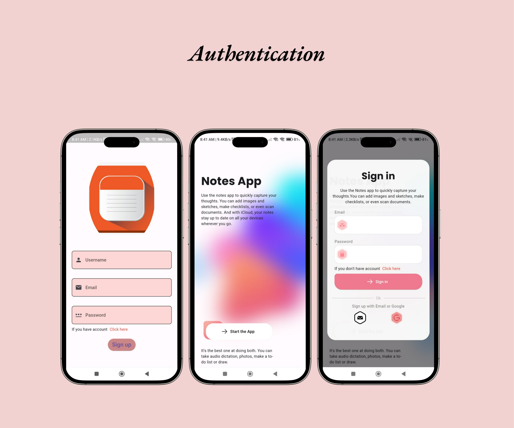
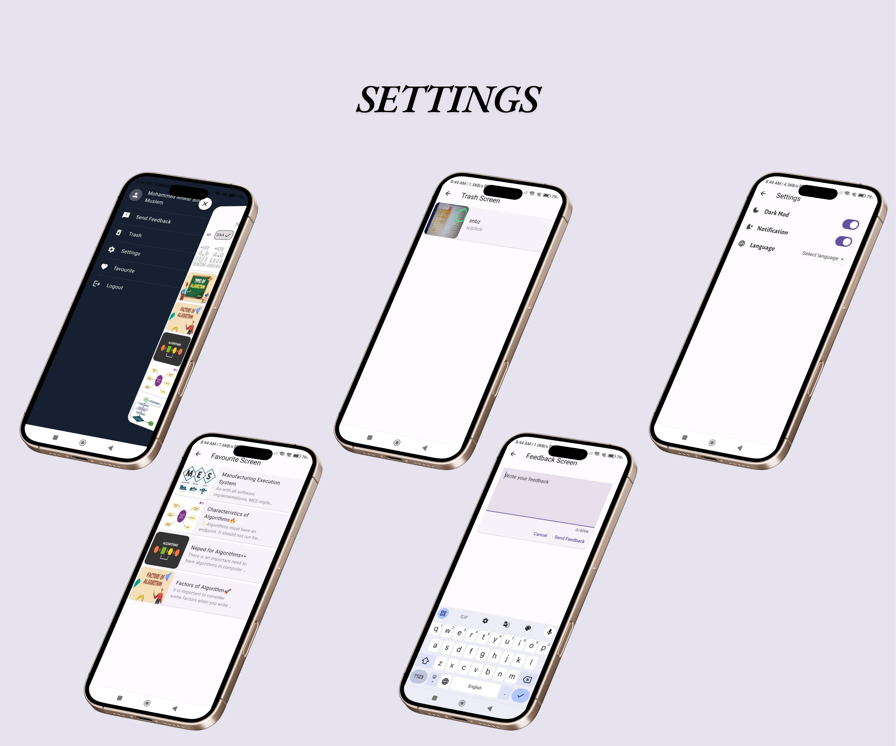
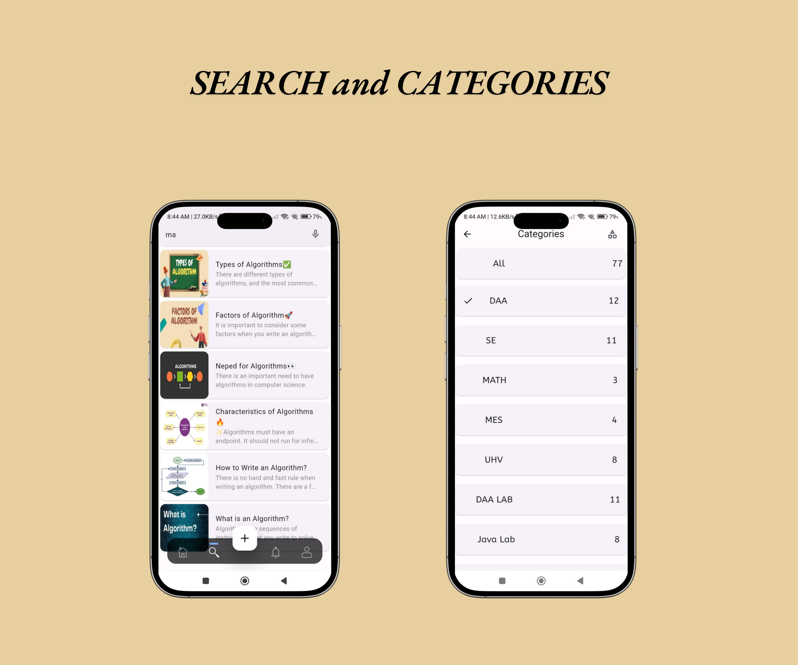

Certainly! Below is the updated **K Note** app documentation with enhanced emoji usage and image paths added above each feature:

---

### **App: K Note** 📝✨

Welcome to **K Note**! 🌟📝 This app is here to revolutionize your note-taking experience with a vast selection of features, all at your fingertips! With its sleek design, powerful functionalities, and an intuitive user interface, **K Note** guarantees a fun, fast, and seamless note-taking journey for everyone! ✨🚀

Whether you’re looking to jot down quick thoughts, record voice memos, or manage your favorite notes, we have it all! 🌟 From easy navigation to secure data handling, everything is designed to make your note-taking experience super smooth! 💻📱

---

## **🌟 Features 🌟**

### 1. **Authentication 🔐🔑**

Logging in, registering, and resetting your password has never been easier or more secure! 🛡️ With **K Note**, we ensure your personal information is protected with advanced security protocols. 🏦🔒

- **Login:** Access your account easily using your credentials! 👨‍💻👩‍💻
- **Register:** Set up your account with just a few simple steps! ✍️📲
- **Forgot Password:** Reset your password quickly and securely! 🔑🧑‍💻

---

### 2. **Create, Read, Update, Delete (CRUD) Notes 📝🗑️**

Manage your notes effortlessly with **K Note**'s CRUD functionalities! 📋🖊️

- **Create:** Add new text, voice, or image notes with ease! 📝🎤📸
- **Read:** View your notes in a clean and organized interface! 📖
- **Update:** Edit your notes anytime to keep them current! ✏️🔄
- **Delete:** Remove notes you no longer need! 🗑️❌

*Note:* **K Note** handles network errors gracefully to ensure a smooth experience. 🌐⚡

---

### 3. **Settings ⚙️🛠️**

Customize your app experience with **K Note**'s settings! 🛠️

- **Feedback:** Share your thoughts and suggestions with us! 🗣️💬
- **App Settings:** Adjust preferences to suit your needs! ⚙️🔧
- **Trash:** Manage deleted notes and recover them if needed! 🗑️🔄
- **Favorites:** Mark important notes for quick access! ⭐📌

---

### 4. **Search & View All Categories 🔍📂**

Find your notes quickly and efficiently with **K Note**'s search and categorization features! 🔎📂

- **Search:** Locate notes by title, content, or tags! 🔍📝
- **Categories:** Organize your notes into custom categories for easy access! 📂🗂️

---

### **📬 Contact Us 📬**
If you have any questions or need assistance, or if you'd like to discuss suggestions or improvements, feel free to reach out to us! We are here to help! 🤗💬

- **Email:** moanbm123@gmail.com 📧
- **LinkedIn:** [@Mohammed Anwar](https://www.linkedin.com/in/mohammad-anwar-bin-muslim-50102725b/) 🐦
- **WhatsApp:** [Contact us on WhatsApp](https://wa.me/+917411440342) 📱

---

### **🌟 Thank you for visiting! 🌟**

We look forward to your feedback and suggestions to continue improving your note-taking experience with **K Note**! ✨💬

--- 
